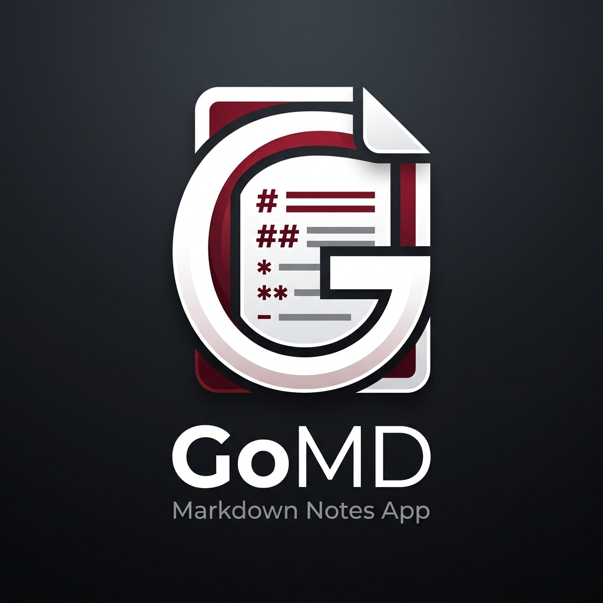
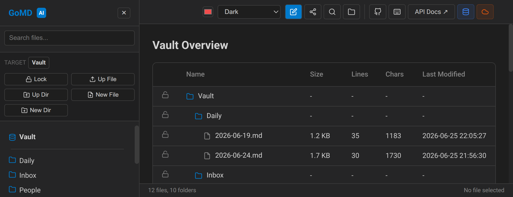
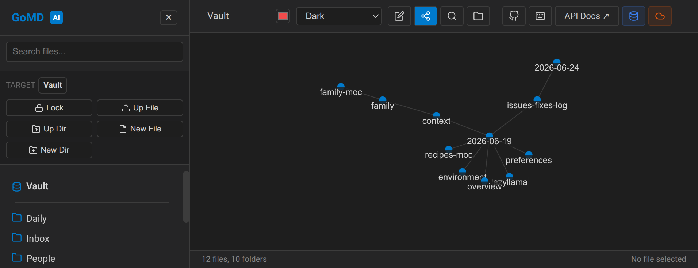
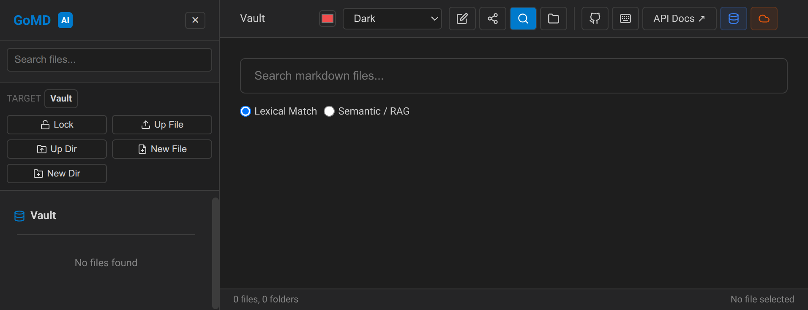

<div align="center">
  
  <h1>GoMD</h1>
  <p><b>Your Second Brain, Supercharged with AI.</b></p>
</div>



GoMD is a blazing-fast, self-hosted Markdown environment built to be your ultimate digital workspace. Think of it as **Obsidian for the web**, but designed from the ground up with AI integration, real-time sync, and enterprise-grade automated backups.

## 🚀 Why GoMD?

### 🧠 Your Ultimate AI Memory
Turn your notes into an active brain. GoMD natively integrates with **Qdrant** and local LLMs (via Llama.cpp) to index your thoughts. Instantly chat with your vault, find semantic relationships across thousands of documents, and let AI retrieve exactly what you need, when you need it.

### 🌍 Take Obsidian Anywhere
Already use Obsidian? Perfect. Point GoMD at your existing Obsidian vault, and instantly access all your notes, backlinks, and graph views from any browser, anywhere in the world—with zero vendor lock-in.

### ⚡ Built for Speed
Written entirely in Go with a lightweight React + Vite frontend, GoMD handles thousands of Markdown files without breaking a sweat. Real-time Server-Sent Events (SSE) mean your UI updates instantly the millisecond a file changes on disk.

### 🛡️ Secure, Private, and Yours
- **Git Auto-Sync**: Automatically back up your vault to GitHub/GitLab without lifting a finger.
- **S3 Snapshots**: Take hourly snapshots of your entire vault to any S3-compatible backend (like AWS or our built-in VersityGW).
- **Self-Hosted**: Run it locally, on a Raspberry Pi, or a remote VPS. Your data never leaves your control.

## 📸 See It In Action

| Graph View | Semantic Search |
|:---:|:---:|
|  |  |

*Visualize connections effortlessly, or search your entire history by meaning, not just keywords.*

---

## 🛠️ Quick Start

Want to spin it up in seconds? We ship a single-binary Docker container with the frontend completely embedded!

```bash
docker run -p 3000:3000 -v ./my-vault:/app/vault ghcr.io/nroitero/gomd:latest
```

## 📖 Documentation

Ready to unlock full AI capabilities, local LLMs, and automated backups? 

👉 **[Dive into the Full Technical Documentation](docs/technical-details.md)** to set up the complete Docker Compose stack and learn about advanced configuration options.
